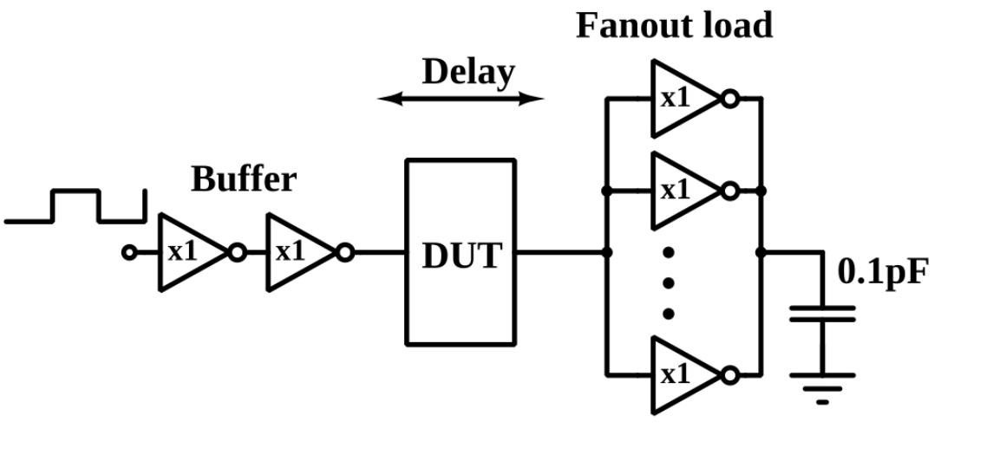

# VLSI-Logical-Effort-
Using ngspice, designing a minimum sized CMOS inverter such that the rise time and fall time are equal for some load capacitance.
Evaluating the inverter delay for different fanouts and thus understanding the concept of logical effort.

Goto [Documentation](https://github.com/sourabh-suri/VLSI-Logical-Effort-/blob/master/Documentation.pdf) for all details.....
